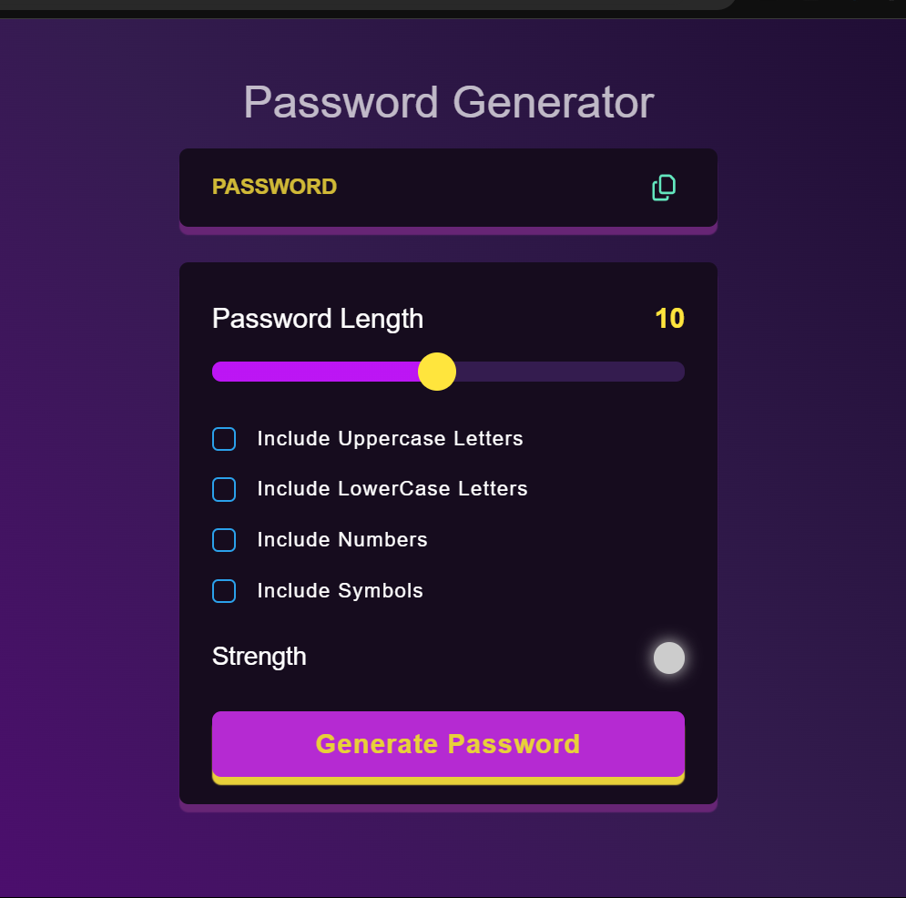

 
# Password Generator

## Description
A **Password Generator** web application that allows users to generate secure passwords with customizable options like length, the inclusion of uppercase letters, lowercase letters, numbers, and symbols. This project is built using **HTML**, **CSS**, and **JavaScript**.

## Features
- Adjustable password length.
- Option to include:
  - Uppercase letters
  - Lowercase letters
  - Numbers
  - Symbols
- Password strength indicator.
- Copy generated password to clipboard with one click.

## Screenshot

## Demo
You can check the live demo of the Password Generator [here](https://password-generator-chi-lake.vercel.app/).

## Technologies Used
- **HTML5** for the structure of the webpage.
- **CSS3** for styling and making the UI visually appealing.
- **JavaScript (ES6)** for generating passwords and managing the app's interactivity.

